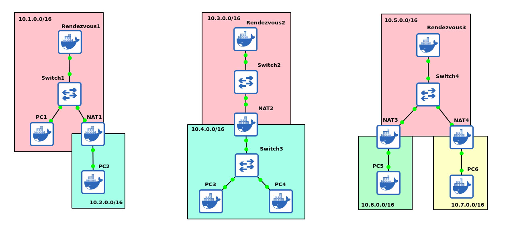
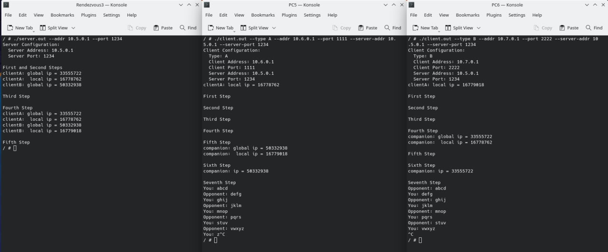

# NAT hole punching

Метод создания соединения между двумя компьютерами, находящимися за NAT.

## Сборка

Проект собирается с помощью системы сборки Make.

```bash
git clone --branch NAT-hole-punching https://github.com/ludmilastemp/Networks-MIPT.git
cd Networks-MIPT
make
```

## Примеры различных схем



## Примеры установления соединения


