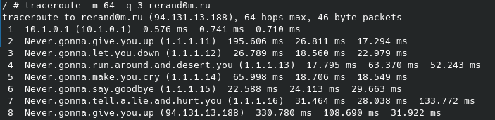

# ICMP_and_DNS

Имитация поведения, как при попытке узнать маршрут к хосту bad.horse.

## Сборка и запуск

```bash
git clone --branch ICMP_and_DNS https://github.com/ludmilastemp/Networks-MIPT.git
cd Networks-MIPT
python3 bad_horse.py -q 1 --ip 94.131.13.188
```

## Пример работы


